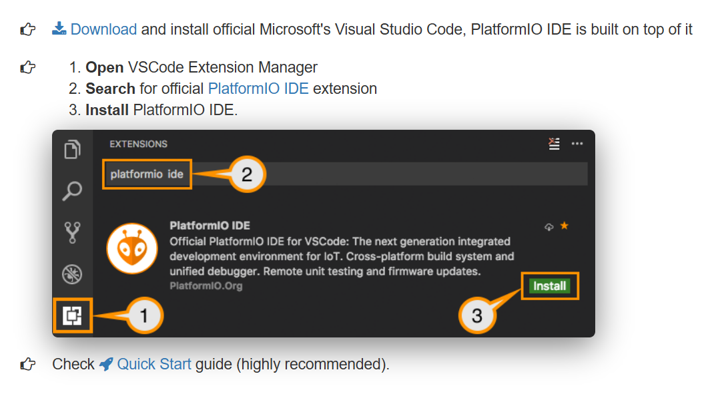
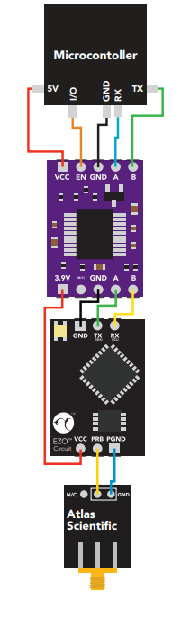

# Smart Sea Wall Embedded Code Development
Repo for ESP32 Smart Sea Wall Development code.  

## Development for camera coding
To-Do:
 - Integrate camera
 - take photo
 - save photo to sd
 - send photo wirelessly

***

## Table of Contents
- [Introduction](#introduction)
- [Contains](#contains)
- [Features](#features)
- [Getting Started](#getting-started)
- [Installation](#installation)
- [Usage](#usage)
- [Issues that are Important to Know](#issues-that-are-important-to-know)
- [Next Steps](#next-steps)
- [Contribution](#contribution)
- [Senior Design 2024 Progress](#senior-design-2024-progress)
- [Current Development](#current-development)
- [Acknowledgments](#acknowledgments)
***
### Introduction
This was originally a Senior Design Project at FIU from 2024, however, it has migrated to a full-fledged project backed by the Institute of Environment and Department of Architecture starting fall of 2024. This project was created a low-cost solution to monitoring the coastal waters in Miami by placing these embedded systems into sea walls. The device will gather salinity, conductivity, dissolved oxygen, pH, temperature, turbidity, and the humidity of the embedded sensors themselves.

The device is utilizing the cellular network to communicate data to a server, which is then displayed on a website for the public to view.
***
## Features

- Cellular communication
- Low cost
- Solar powered
- Low maintanence
- Modular

***
## Components
- ESP32 Lilygo T-SIM7000G
- Atlas Salinity and Conductivity Sensor
- Atlas Dissolved Oxygen Sensor
- Atlas pH Sensor
- DFR Robot Turbidity Sensor
- DS18B20 Temperature Sensor
- DHT22 Humidity Sensor
- 5V Boost Converter
- Adafruit 12-bit I2C ADC
- Adafruit OV5640 Camera (Not-Developed)
***

## Getting Started

To get started, you must first install VS Code and have the Lilygo ESP32 T-SIM7000G. You can download VS Code from this website: https://code.visualstudio.com/download 

And you can buy the ESP32 from this link: https://lilygo.cc/products/t-sim7000g?srsltid=AfmBOorPlYeN0B0XtBGR9IOZxBNaTgh5x8RhMpcV2bvTMS_T_vZF39H0
***

## Installation
You'll need two things to download this code, VS Code and PlatformIO. Platform IO is an add-on for VS Code, and it allows the project to utilize arduino libraries to easily interface sensors to our ESP32. 

1. VS Code Download Link: https://code.visualstudio.com/download

2. Download PlatformIO in VS Code:


3. Clone the GitHub Repo and upload to your ESP32.
    - Must be using the exact same ESP32 to run correctly

***
## Usage
1. **Build and Review the Code:**
    - Build the code to ensure that all libraries are operating correctly and there are no errors. If there are errors, with libraries not being found from ESP-IDF, make sure to include the directory of it from your platformIO installation folder.

4. **Uploading Code:**
    - Open VS Code and navigate to the PlatformIO extension.
    - Open the cloned repository.
    - Connect your ESP32 to your computer via USB.
    - Click on the "Upload" button in PlatformIO to upload the code to the ESP32.
    - Ensure the code has no errors and is looping correctly

3. **Accessing Cellular Network:**
    - The device should automatically connect to the cellular network. Ensure that the SIM card is properly inserted and has an active data plan.
    - If the sim card is not an EmbeddedWorks sim, make sure to go to the Cellular.cpp library and change the following code to your carrier's settings:
    ```c++
    #include "Cellular.h"
    #include "globals.h"

    #define networkTimeout 60000    //1 Minute of network connection waiting
    #define checkSignal false
    const char apn[]  =  "";    //Set your APN depending on sim used
    const char gprsUser[] = "";
    const char gprsPass[] = "";
    ```
    - If the domain you want to send it to is different than the current domain, please change the following variables:
    ```c++
    const char server[]   =  "";        //Domain where you will be sending/receiving data
    const char resource[] = "/post";    //The path to where you are sending the data
    const int  port       = 443;      
    ```

5. **Monitoring Data:**
    - The device will start collecting data from the sensors and transmit it to the server.
    - You can view the data on the designated web application.

6. **Configuration:**
    - If you need to change any configurations (e.g., sensor thresholds, data transmission intervals), modify the `config.h` file in the repository and re-upload the code.

7. **Troubleshooting:**
    - If the device is not working as expected, check the serial monitor in VS Code for any error messages.
    - Ensure all sensors are properly connected and functioning.

***
## Issues that are Important to Know
Much of this code is buggy, or has been written without the intention of optimizing to its full capacity. 

Known issues:
 - **ESP-IDF Library Package Errors:** ESP-IDF Library package directories may not be declared in the `C/C++ edit configurations` settings in VS Code. If you run the code and get an error about a `esp-___.h folder undefined`, you may need to find it in the PlatformIO directories and add it to the configurations.
  - **I2C Addresses and Helper Functions:** If you make the kit from scratch and if you purchase different peripherals, you may need to change the I2C addresses and alter the helper libraries to include your new peripheral. All I2C address can be found in their helper .h file, with the exception of Atlas Scientific sensors. Atlas sensors have a helper function which automatically sets up their interface to I2C.
  - **Cellular Server Certificates:** There is a way to upload certificates to the ESP32 T-SIM7000G, however the certificates must be refreshed every 3 months. Additionally, it requires you to plug the ESP32 into a battery, then connect it to your PC to access the SIM7000G file system. You may need to update the firmware as well. More information can be found in the following link: https://github.com/botletics/SIM7000-LTE-Shield/wiki/Updating-Firmware
  - **Adafruit I2C ADC:** If you are attempting to use this ADC, keep in mind that the size of the ADC includes the negative voltage as well. So if you are attmpting to measure just positive voltage, please use half of the total 12 bit decimal value (4096/2 = 2048)
  - **Unavailable Pins:** Please take a look at the Lilygo ESP32 T-SIM7000G pinout and see which pins are being used by the SD Card and SIM module. None of these pins will be available to use as they will break your code.

***
## Next Steps:
 - Attach and program a camera to take a photo whenever the       device turns on. **(OV5640 Camera)**
 - Redesign PCB board with embedding everying in mind 
    - All Atlas Scientific sensor circuits can seperate their SMA connection with their circuit to remove excess room taken up by the sensors. **(Requires RF circuit and PCB design experience)**
        - Proposed Schematic: (You may connect as many I2C devices as you would like)
        
    - Swap current temperature sensor with Atlas Scientific temperature sensor
    - Embed a 3.3V to 5V boost converter without having to purchase products.
 - Reduce power consumption **(e.g. optimzing sensor power, cellular power, and time of sensor readings)**.
 - Optimize solar power charging

***
## Contributions
The following names are the participants of this project while during Senior Design 2024 and after.

- **Administrators:**
    - **Principal Investigator:** Shahin Vassigh 
    - **Post-Doctoral Canidate:** Sara Pezeshk
    <br>
- **Senior Design 2024 Team Participants**
    - **Lead Electrical and Embedded Engineer:** Nathan Chung
    - **Embedded Engineer:** Dianelys Rocha Jimenez
    - **RF and Electronics Engineer:** Anthony Perez-Pinon
    - **Power and Electronics Engineer:** Austin Miranda
    - **Software and Computer Engineer:** Lisette Hawkins
    <br>
- **NSF Funded Research Participants**
    - **Lead Electrical and Embedded Engineer:** Nathan Chung
    - **Lead Software and Database Engineer:** Ivan Mico


***
## Senior Design 2024 Progress Report
For Senior Design 1 the idea and proof of concept is that we will make use of FIU's network alongside Google's API for transmitting data from sensors to a web application.

During Senior Design 2 we will change the system to use either Bluetooth, or LoRa or similar communication that do not depend on internet Access.
In this scenario the idea is user connects to system using bluetooth, receives the data and send it to have global access.

Afterwards, the project was handed in to the RDF lab alongside the Institute of Environment and School of Architecture at Florida International University. The scope of the project remains the same, however, the plans are make it more optimized and easier to use for the everyday person. Meaning maintenance must be easily done, and everything must be totally modular. Testing is required before this device is operational.
***

## Current Development
Currently, we are in the process of implementing wireless communication through SIM and 4G/LTE with the Liligo T-sim7000G. We are currently in the works of hosting our own database and web server to remain totally local as according to the rules of FIU. Development in currently focused on cellular connectivity development, however that also includes recoding everything that required WiFi (time of day, https posts, responses, certificates, ect.). Additionally, external peripherals running off I2C were also added for the reduction of wires connected to the ESP32 (I2C 12-bit ADC and IO Extender MCP23017).

***
## Acknowledgments
FIU has the rights to this project through NSF and EPA grant.